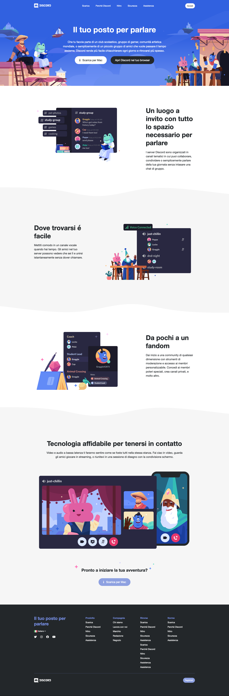
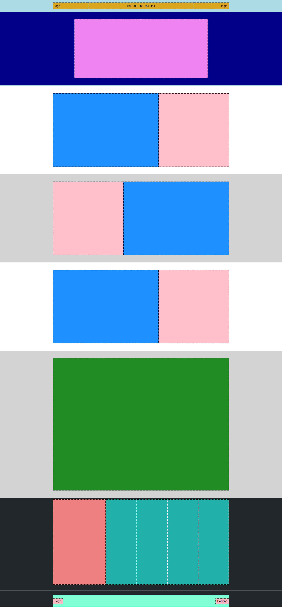

## Esercizio di oggi: Struttura Discord

### cartella/repo `htmlcss-struttura-discord`
#### Descrizione:

> **Riproduzione di un layout intero: Discord** 

1. Partiamo dal realizzare la struttura base del nostro tema solo con i  blocchi colorati senza inserire i veri testi, img etc. o pensare al dettaglio. 

1. Partiamo sempre dall'individuare il layout generale e poi iniziamo dall'alto verso il basso, non passiamo ad una sezione successiva se la precedente non funziona.

1. In linea di massima, consideriamo meglio un esercizio non completo di tutte le sezioni ma che presentino le sezioni fatte in maniera pulita, ordinata e corretta, che un esecizio che arrivi fino al footer ma scritto male, con poca centralizzazione e organizzazione del codice.

>**nota:** Per questo primo layout, vi diamo noi un'idea dei blocchi che possiamo potenzialmente intravedere sul sito. Da domani in poi, toccherà a voi fare l'analisi dei layout sugli esercizi proposti!

**`Consigli:`** _Utilizziamo la console per vedere cosa stiamo facendo.
Aiutiamoci coi border ed il background per vedere effettivamente i nostri blocchi
Non dimentchiamo le altezze, altrimenti potremmo non vedere nulla. E' consigliabile utilizzare la_ **`min-height`** _e ricordarsi che, in caso di presenza di flex,_ **`align-items: stretch`** _è il valore di default._

---
---

---
---

---
---